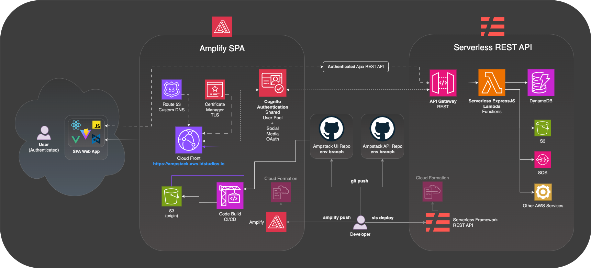

# AmpStack 
## The React Edition

This project is the `AmpStack UI`, which is an __Amplify React Vite based SPA__.  

The backend is implemented in [AmpStack API](https://github.com/ids/ampstack-api).

There are several UI "editions" to explore the various frameworks with Amplify:
- [React (this version)](https://github.com/ids/ampstack-ui) 
- [VanillaJS Backbone (with custom auth)](https://github.com/ids/ampstack-ui/tree/backbone)
- Vue (todo)
- Angular (todo)

> Amplify works really well for SPA publishing via CDN, however I found the `backend` design a bit early going, and doesn't seem to have the robust plugin and development community of Serverless Framework.  Integrating it with the tried and true made for a great combo.  In practical terms, a single SPA would likely need to have have several API backends as part of a micro-service architecture, and this fits the bill nicely.

### Benefits:

- No servers to manage!
- Development environments cost pennies a day.
- Fully scalable simply by increasing DynamoDB WCU and RCU allocations
- Simple development model (once you grok it)
- Integrated CI/CD

## Design


## Amplify Notes
The docs are getting better and better, but the are few things you that will save you hours of lost time.

There are two components to the solution you have to keep in sync:
1. Your `git` branches
2. Your `amplify` environments

While these two generally align, they don't always, such as in the case of a `topic` branch. So after you switch `git` branches, you have to `checkout` the correct Amplify Environment to work with.

__Important__: When switching from a `dev` branch to a `master` branch you also need to switch amplify environments:

Eg.

```
git checkout master
amplify env checkout prod
```

Or

```
git checkout dev
amplify env checkout dev
```

The [amplify](/amplify) folder can be problematic when switching branches.  If troubles come up:

- Delete the `amplify` folder
- run the command `amplify pull --appId XXXXX --envName dev/prod/etc`

You can find the exact command to run by checking the environment details on the Authentication tab, though all you really need is the `appId`.

> __Note:__ that Amplify will ask some bootstrap questions as part of this about your local environment, it is portant to answer __Y__ to the last question of __do you want to make changes to the Backend__, as if you answer __No__, it will fail to pull the [backend](/amplify/backend) folder and then throw errors complaining that it can't find the __backend__ folder.  It is a dumb question.

### Note: team-provider-info.json
In order to use this repo you will need to remove the amplify folder entirely and replace it with your own by using the `amplify cli`.  There is one core file that contains what some might consider sensitive information, and it is [team-provider-info.json](https://github.com/aws-amplify/amplify-cli/issues/1779).

In private repos it is checked in and shared among the team... in this repo it isn't. Best to keep that out and manage it independently.

### General Amplify Setup
The following loosely describes the steps for setting up the core scaffolding of the AmpStack.  Check the Amplify docs for details if you've never done it before.

> If you fork this project as a bootstrap make sure to delete the `amplify` folder and create your own.

- `npm create vite@latest my-ampstack-ui -- --template react`

- `git init`

- `amplify init`, this is where it all begins

- `amplify add auth`, you can follow the steps in the docs here for you preferred Cognito setup.

- Setup Git Repo and configure for CI/CD hosting and deploy with `git push`

- `amplify update auth` for Oauth providers & secrets, and make sure all your responseURI and redirectURIs are set.

- Verify `amplify serve` works

- `npm install` all the stuff in `package.json`

- .eslintrc.cjs needs `"react/prop-types": 0,` if you don't like proptypes, and I do not.

- Amplify needs global in the index.html with `Vite`, as per:

```
<script>
      // AWS Amplify needs this to work. See https://github.com/aws/aws-sdk-js/issues/3673
      const isBrowser = () => typeof window !== "undefined";
      const isGlobal = () => typeof global !== "undefined";
      if (!isGlobal() && isBrowser()) {
        var global = window;
      }
</script>
```

- And a resolver in `vite.config.js`:

```
resolve: {
    alias: {
      "./runtimeConfig": "./runtimeConfig.browser",
    }
  }
```
(as per the codebase)

- `amplify push` will update your Cloud Formation resources as required, and `git push` to the respective branch environments wil deploy via CD accordingly.

### Vite Environment Variables
These are contained in the `.env.sample`, which should be renamed to `.env` and populated with the correct environment values, such as the REST API endpoint.

The `.env` file is only used for local Vite development.

```
VITE_EXPRESS_ENDPOINT=https://XXXXXXXXX.execute-api.us-east-1.amazonaws.com/dev
VITE_EXPRESS_ENDPOINT_REGION=us-east-1
```

For deployments the `VITE_EXPRESS_ENDPOINT` variables are added to the Amplify environment ENV variables via the Console.

> __Note__: The __VITE_*__ environment variables are only populated during Vite's build phase, you need to do a redeploy after changing them for the changes to take effect.

## API Endpoint
Make sure to update the __VITE_EXPRESS_ENDPOINT__ in the Amplify UI __Environment Variables__ correctly for the associated backend.  This will be an endpoint URL provided by your [Amplify API](https://github.com/ids/ampstack-api) `sls deploy`.

```
VITE_EXPRESS_ENDPOINT=https://XXXXXXXXX.execute-api.us-east-1.amazonaws.com/dev
```